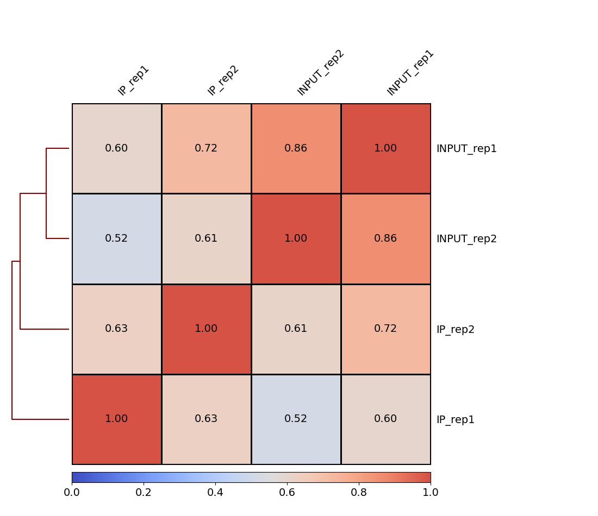
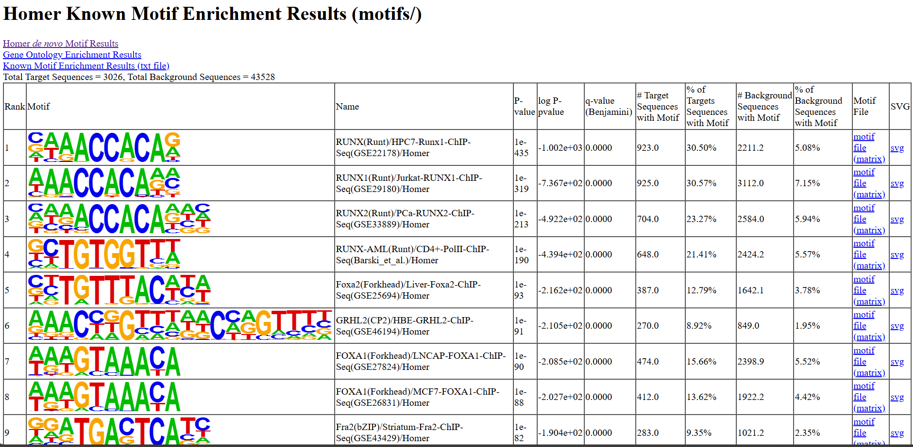
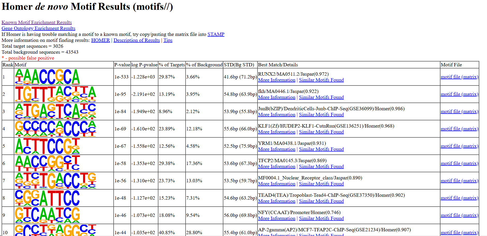
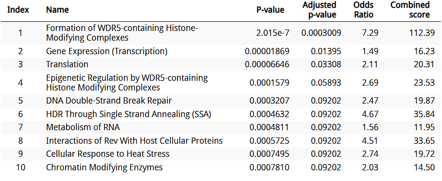
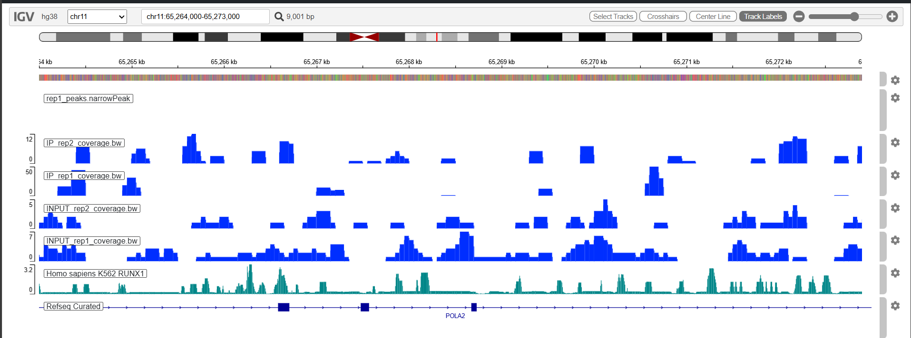
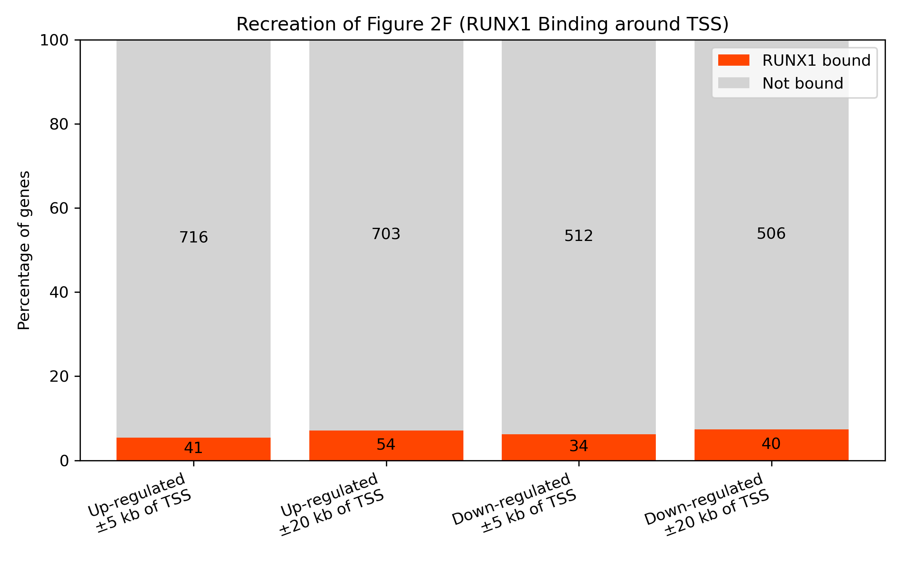

# ChIPseq-nf-pipeline

This repository provides a streamlined Nextflow-based pipeline for processing ChIP-seq data, encompassing quality control, alignment, peak calling, and downstream analyses.

## 📁 Repository Structure

- `main.nf` – Primary Nextflow pipeline script  
- `nextflow.config` – Configuration file specifying parameters and resources  
- `envs/` – Conda environment specifications  
- `modules/` – Custom Nextflow modules  
- `Final.ipynb` – Jupyter notebook for downstream analyses and visualizations  
- `full_samplesheet.csv` / `subset_samplesheet.csv` – Sample metadata files  
- `gene_list.txt` – List of genes for targeted analyses  
- `*.png` – Generated figures from analyses  

## Getting Started

### Prerequisites

- [Nextflow](https://www.nextflow.io/docs/latest/getstarted.html) (version ≥ 21.10.3)  
- [Conda](https://docs.conda.io/en/latest/) for environment management  

### Installation

1. Clone the repository:
   ```bash
   git clone https://github.com/vassan1h/ChIPseq-nf-pipeline.git
   cd ChIPseq-nf-pipeline
   ```

2. Set up the Conda environment:
   ```bash
   conda env create -f envs/environment.yml
   conda activate nextflow_base
   ```

3. Run the pipeline:
   ```bash
   nextflow run main.nf 
   ```

## Visualizations

The `Final.ipynb` notebook generates several key plots:

- **Spearman Correlation Heatmap**  
  

- **HOMER Known Motifs**  
  

- **HOMER De Novo Motifs**  
  

- **Reactome Pathway Enrichment**  
  

- **IGV Snapshot**  
  

- **Figure 2F from [Reference](https://pmc.ncbi.nlm.nih.gov/articles/PMC5071180/)**
  
## Reference

This pipeline is based on this publication:
[RUNX1 contributes to higher-order chromatin organization and gene regulation in breast cancer cells](https://pmc.ncbi.nlm.nih.gov/articles/PMC5071180/)

## 👤 Author

**Vassanth**, M.S. in Bioinformatics  
